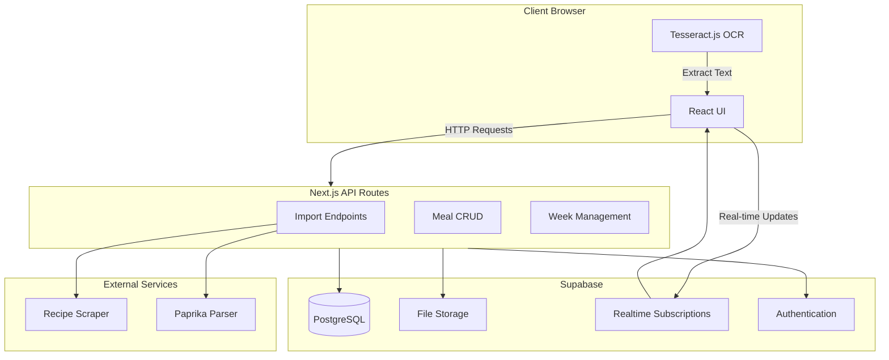

# Meal Planner Design Document

## Overview

A web application that provides a "browse and choose" meal selection experience similar to Home Chef. The app serves as a curated stream of meal ideas for weekly planning, allowing users to add meals from various sources and browse them in a consistent, visually appealing format.

## Core Requirements

### Primary Goals
- **Meal Stream**: A weekly collection of meal ideas that can be easily browsed
- **Consistent Format**: All meals displayed with name, photo, and estimated cooking time
- **Quick Selection**: Fast browsing and selection interface optimized for mobile use
- **Multi-source Import**: Support for adding meals from URLs, Paprika exports, and cookbook photos

### Non-Goals
- Full recipe management system (users already use Paprika)
- Meal scheduling/calendar functionality
- Shopping list generation
- Nutritional tracking

## User Flows

### 1. Add Meals Flow

```
User → Choose Import Method → Provide Source → System Processes → Meal Added to Stream
```

**Import Methods:**
- **URL Import**: User pastes URL from cooking website → System scrapes/extracts recipe data
- **Paprika Export**: User uploads Paprika export file → System parses and imports recipes
- **Photo OCR**: User uploads photo of cookbook page → OCR extracts text → User confirms/edits → Meal added

### 2. Browse and Select Flow

```
User → View Meal Stream → Browse Grid/List → Tap Meal → View Details → Select/Deselect
```

**Views:**
- **Overview**: Grid or list of meal cards showing name, photo, cooking time
- **Detail**: Full recipe with ingredients, instructions, source attribution
- **Selection State**: Visual indication of selected meals for the week

## Data Model

### Meal Entity
```typescript
interface Meal {
  id: string;
  name: string;
  photoUrl: string;
  estimatedCookingTime: number; // in minutes
  ingredients: Ingredient[];
  instructions: string[];
  source: {
    type: 'url' | 'paprika' | 'manual' | 'photo';
    url?: string;
    originalData?: any;
  };
  tags?: string[];
  createdAt: Date;
  updatedAt: Date;
  selectedForWeek?: string; // week identifier (e.g., "2024-W15")
}
```

### Ingredient Entity
```typescript
interface Ingredient {
  name: string;
  amount?: string;
  unit?: string;
  notes?: string;
}
```

### Week Entity
```typescript
interface Week {
  id: string; // format: "YYYY-Www" (e.g., "2024-W15")
  startDate: Date;
  endDate: Date;
  selectedMeals: string[]; // meal IDs
}
```

## Architecture

### Technology Stack

**Frontend:**
- **Framework**: Next.js 14+ (App Router)
- **UI Library**: React
- **Styling**: Tailwind CSS
- **State Management**: React Context + React Query for server state
- **Image Handling**: Next.js Image component with optimization

**Backend:**
- **API**: Next.js API Routes
- **Database**: Supabase (PostgreSQL with real-time subscriptions)
- **Authentication**: Supabase Auth (for multi-device sync)
- **File Storage**: Supabase Storage (for meal photos)

**External Services:**
- **Recipe Scraping**: Recipe extraction library (e.g., `recipe-scraper` npm package)
- **OCR**: Tesseract.js (client-side) or cloud OCR API (e.g., Google Vision API)
- **Paprika Parser**: Custom parser for Paprika export format

### System Architecture Diagram



## Key Features

### 1. Meal Import System

#### URL Import
- User pastes URL from cooking website
- Backend uses recipe scraper to extract:
  - Recipe name
  - Ingredients list
  - Instructions
  - Estimated cooking time (if available)
  - Recipe image
- User reviews and confirms extracted data
- Meal added to stream

#### Paprika Export Import
- User uploads Paprika export file (`.paprikarecipes` format)
- Backend parses XML/JSON structure
- Extracts all recipes and presents as list
- User selects which recipes to import
- Bulk import selected recipes

#### Photo OCR Import
- User uploads photo of cookbook page
- Client-side OCR (Tesseract.js) extracts text
- User reviews extracted text and corrects if needed
- System attempts to parse recipe structure (name, ingredients, instructions)
- User confirms and meal is added

### 2. Meal Browsing Interface

#### Overview View
- **Layout**: Responsive grid (3 columns desktop, 2 tablet, 1 mobile)
- **Meal Card Components**:
  - Recipe photo (lazy-loaded, optimized)
  - Recipe name
  - Estimated cooking time badge
  - Selection indicator (checkbox or highlight)
  - Quick action buttons (view details, remove)
- **Filtering**: By cooking time, tags, source type
- **Search**: Text search across meal names and ingredients

#### Detail View
- Full-screen or modal overlay
- Large recipe photo
- Complete ingredient list
- Step-by-step instructions
- Source attribution
- Actions: Select/Deselect, Edit, Delete

### 3. Week Management

- Each week has a unique identifier (ISO week format)
- Users can select/deselect meals for current or future weeks
- Visual indication of selected meals
- Simple count of selected meals per week

### 4. Real-time Sync

- Supabase real-time subscriptions for meal updates
- Changes from one device immediately reflect on others
- Optimistic UI updates for better UX

## UI/UX Design Principles

### Mobile-First
- Primary interface optimized for phone browsing
- Touch-friendly targets (minimum 44x44px)
- Swipe gestures for quick actions

### Visual Consistency
- All meal cards use same layout and styling
- Consistent photo aspect ratios (16:9 or 4:3)
- Unified color scheme and typography

### Performance
- Image optimization and lazy loading
- Virtual scrolling for large meal lists
- Efficient data fetching with React Query

### Accessibility
- Keyboard navigation support
- Screen reader friendly
- High contrast mode support
- Alt text for all images

## Implementation Phases

### Phase 1: Core Infrastructure
- [ ] Next.js project setup with TypeScript
- [ ] Supabase integration (database, auth, storage)
- [ ] Basic authentication flow
- [ ] Database schema creation
- [ ] API route structure

### Phase 2: Meal Management
- [ ] Manual meal entry form
- [ ] Meal CRUD operations
- [ ] Basic meal list view
- [ ] Meal detail view

### Phase 3: Import Functionality
- [ ] URL import with recipe scraper
- [ ] Paprika export parser
- [ ] Photo upload with OCR
- [ ] Import review/confirmation UI

### Phase 4: Browsing Interface
- [ ] Responsive meal grid/list view
- [ ] Meal card component with photo, name, time
- [ ] Filtering and search
- [ ] Selection state management

### Phase 5: Week Management
- [ ] Week selection interface
- [ ] Meal-to-week assignment
- [ ] Selected meals view

### Phase 6: Real-time Sync
- [ ] Supabase real-time subscriptions
- [ ] Multi-device sync testing
- [ ] Conflict resolution

### Phase 7: Polish
- [ ] Image optimization
- [ ] Performance optimization
- [ ] Error handling
- [ ] Loading states
- [ ] Mobile responsiveness refinement

## Technical Considerations

### Recipe Scraping
- Use established npm packages like `recipe-scraper` or `@jamescoyle/recipe-scraper`
- Handle various website formats
- Fallback to manual entry if scraping fails

### OCR Processing
- Start with client-side Tesseract.js for privacy
- Consider cloud OCR (Google Vision, AWS Textract) for better accuracy if needed
- Provide manual correction interface

### Paprika Format
- Paprika exports are typically XML or JSON
- Need to parse and map to internal meal structure
- Handle edge cases (missing fields, special characters)

### Image Handling
- Store images in Supabase Storage
- Generate thumbnails for grid view
- Use Next.js Image component for optimization
- Support multiple image formats (JPEG, PNG, WebP)

### Data Validation
- Validate all imported data
- Sanitize user inputs
- Handle malformed recipe data gracefully

## Security Considerations

- Authentication required for all operations
- User data isolation (users can only access their own meals)
- Input sanitization for XSS prevention
- Rate limiting on import endpoints
- Secure file upload handling

## Future Enhancements (Out of Scope for MVP)

- Meal rating/reviews
- Meal sharing between users
- Recipe scaling (serving size adjustments)
- Integration with other recipe managers
- Meal planning calendar view
- Export functionality

## Success Metrics

- Users can successfully import meals from all three sources
- Meal browsing is fast and intuitive on mobile devices
- Real-time sync works reliably across devices
- Users can select meals for a week in under 2 minutes

## Top name ideas
- MealPick
- MealStream
- ForkPick
- CookPick
- Cookstream
- Picknic 
- Toothpick